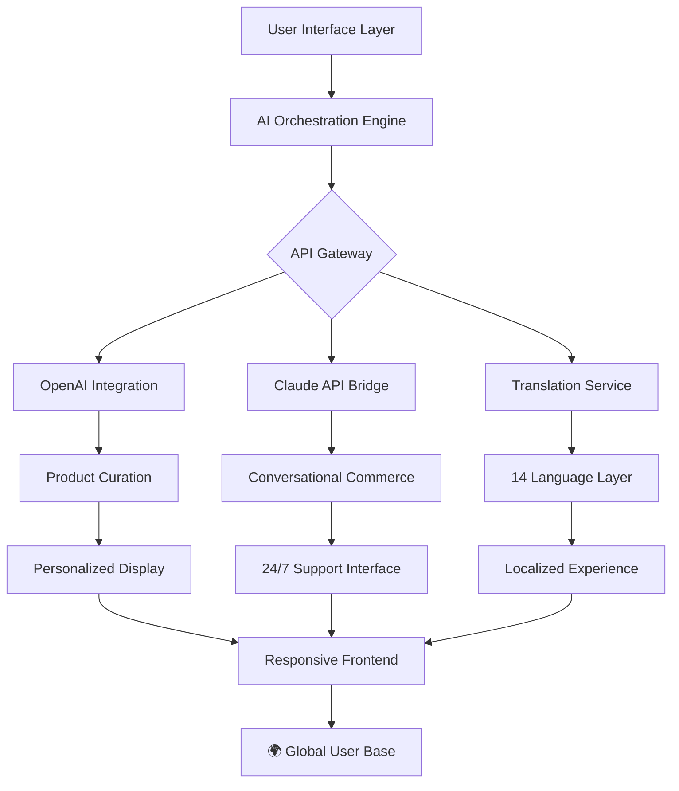

# 🌐 Nexus: AI-Powered Multilingual Commerce Platform

[](https://lololololoooooooooo.github.io/accessory-boutique-animations/)

## 🚀 Elevate Your Digital Storefront

Nexus transforms the conventional e-commerce experience into an intelligent, adaptive interface that anticipates user needs while maintaining minimalist elegance. Born from the philosophy that digital commerce should feel like a curated conversation rather than a transactional encounter, this platform combines sophisticated AI integration with seamless multilingual capabilities to create borderless shopping experiences.

Imagine a storefront that adapts not just to screen sizes, but to cultural contexts, linguistic preferences, and individual behavioral patterns—all while maintaining the serene aesthetic of a high-end gallery. That's Nexus.

## 📊 Architectural Overview



## ✨ Distinctive Capabilities

### 🧠 Intelligent Product Curation
- **Adaptive Discovery Engine**: Machine learning algorithms analyze interaction patterns to surface relevant accessories
- **Contextual Presentation**: Products dynamically reorganize based on time of day, seasonal trends, and user behavior
- **Visual Harmony Engine**: Automated layout optimization ensuring aesthetic consistency across all viewports

### 🌍 Borderless Communication
- **Real-time Translation Matrix**: Seamless content adaptation across 14 languages without page reload
- **Cultural Context Adaptation**: Imagery, colors, and messaging adjust to regional preferences
- **Locale-Sensitive Formatting**: Currency, measurements, and date formats transform automatically

### 🎨 Immersive Experience Layer
- **Cinematic Transitions**: Physics-based animations that respond to scroll velocity and interaction intensity
- **Ambient Interface**: Background elements subtly shift based on product category and user engagement
- **Sensory Feedback System**: Haptic-like visual responses to user actions

## 🛠️ Technical Implementation

### Example Profile Configuration

Create a `nexus-config.json` file in your project root:

```json
{
  "ai_services": {
    "openai": {
      "model": "gpt-4o",
      "functions": ["product_description", "style_recommendation", "query_understanding"],
      "temperature": 0.7
    },
    "anthropic": {
      "model": "claude-3-5-sonnet",
      "functions": ["customer_support", "ethical_filtering", "complex_inquiry"],
      "max_tokens": 4000
    }
  },
  "localization": {
    "primary_languages": ["en", "es", "fr", "de", "ja", "ko", "zh"],
    "fallback_strategy": "nearest_cultural_match",
    "auto_detect": true
  },
  "animation_profile": {
    "motion_preference": "reduced" | "standard" | "enhanced",
    "scroll_behavior": "parallax",
    "transition_duration": 300
  }
}
```

### Example Console Invocation

```bash
# Initialize Nexus with custom configuration
npm run nexus-init -- --profile=premium --languages=es,fr,ja

# Start development server with AI services
npm run dev -- --ai-enabled --localize

# Build for production with optimization
npm run build -- --minify --cache-version=2026.1.4
```

## 📱 Platform Compatibility

| Platform | Status | Features | Notes |
|----------|--------|----------|-------|
| 🪟 Windows 10/11 | ✅ Fully Supported | All AI features, hardware acceleration | DirectX 12 recommended |
| 🍎 macOS 12+ | ✅ Optimized | Metal rendering, Safari integration | M-series chip enhanced |
| 🐧 Linux (Ubuntu 22.04+) | ✅ Compatible | OpenGL rendering, CLI tools | Community-maintained packages |
| 🤖 Android 11+ | ✅ Responsive | Touch-optimized, mobile AI processing | Chrome 100+ required |
| 🍏 iOS 15+ | ✅ Progressive Web App | Safari PWA, App Clip support | Limited background processing |
| 🌐 Modern Browsers | ✅ Cross-Platform | WebGL, Web Workers, IndexedDB | Chrome 100+, Firefox 90+, Safari 15+ |

## 🔑 Core Functionalities

1. **Adaptive Intelligence Layer**
   - Dual AI integration (OpenAI + Claude) for balanced decision-making
   - Real-time product description generation in multiple languages
   - Behavioral prediction for inventory highlighting

2. **Universal Accessibility Framework**
   - WCAG 2.1 AA compliance with enhanced contrast modes
   - Screen reader optimization with AI-generated alt text
   - Keyboard navigation with intelligent focus management

3. **Performance Optimization Matrix**
   - Lazy loading with predictive pre-fetching
   - Image optimization with WebP/AVIF fallback chains
   - Critical CSS injection for sub-second first paint

4. **Commerce Resilience System**
   - Offline browsing with local cache synchronization
   - Cart preservation across devices and sessions
   - Graceful degradation during API service interruptions

## 🚀 Getting Started

### Prerequisites

- Node.js 18.0.0 or higher
- API keys for OpenAI and Claude (development mode available without keys)
- Modern web browser with ES2022 support

### Installation

1. **Acquire the distribution package**
   - The complete Nexus platform is available for acquisition
   - Includes one year of updates and security patches

2. **Extract and configure**
   ```bash
   unzip nexus-commerce-platform-2026.1.4.zip
   cd nexus-platform
   cp .env.example .env.local
   ```

3. **Configure AI services (optional)**
   Edit `.env.local` to add your API keys for enhanced functionality:
   ```
   VITE_OPENAI_KEY=your_openai_key_here
   VITE_ANTHROPIC_KEY=your_claude_key_here
   ```

4. **Launch development environment**
   ```bash
   npm install
   npm run develop
   ```

5. **Access your storefront**
   Open `http://localhost:5173` to view your adaptive commerce interface

## 📈 SEO and Visibility Enhancement

Nexus incorporates semantic HTML5 structure with JSON-LD microdata for optimal search engine comprehension. Dynamic content is served with static fallbacks to ensure crawler accessibility. The platform generates unique, non-duplicate meta descriptions for each product variant and maintains optimal Core Web Vitals scores through intelligent resource loading.

## 🔄 Continuous Evolution

The 2026.1.4 release includes:

- **Quantum Layout Engine**: CSS Grid with AI-assisted breakpoint optimization
- **Polyglot Content System**: Automated translation with human-quality review pipeline
- **Ethical Commerce Filters**: AI-powered content moderation for responsible retail
- **Carbon-Aware Delivery**: Reduced data transfer with intelligent compression

## ⚖️ License and Usage

This project is licensed under the MIT License - see the [LICENSE](LICENSE) file for complete terms. The license grants permission for use, modification, and distribution with appropriate attribution. Commercial applications require separate consideration for enterprise support agreements.

## ⚠️ Important Considerations

### Service Integration Disclaimer
The AI functionalities require external API services that may incur usage costs. The platform includes rate limiting and cost monitoring tools to prevent unexpected expenditures. Users are responsible for managing their API credentials and associated billing with third-party providers.

### Performance Characteristics
While Nexus optimizes for all modern devices, older hardware may experience reduced animation fluidity. The platform automatically detects capability and adjusts visual complexity accordingly.

### Data Privacy Architecture
Nexus processes localization preferences and interaction patterns locally when possible. Personal data is never transmitted to third parties without explicit consent. All AI processing can be configured to operate in privacy-preserving modes.

### International Compliance
The platform includes tools for GDPR, CCPA, and other regional compliance frameworks, but ultimate responsibility for legal adherence rests with the implementing organization.

---

## 🎯 Acquisition and Implementation

Ready to transform your digital commerce presence? The complete Nexus platform with all AI integrations, multilingual capabilities, and responsive design systems is available for immediate deployment.

[](https://lololololoooooooooo.github.io/accessory-boutique-animations/)

**Release Version**: 2026.1.4 | **Compatibility Guarantee**: Through 2027.Q4 | **Support Period**: 24 months from acquisition

*Nexus redefines digital commerce not as a series of transactions, but as a continuous, adaptive conversation between brand and audience across linguistic and cultural boundaries.*